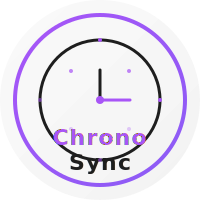

# ChronoSync

<div align="center">



**A cross-platform time synchronization and scheduling application**

[](LICENSE)
[](./docs/contributing/guidelines.md)
[](https://vuejs.org/)
[](https://expressjs.com/)

</div>

## About ChronoSync

ChronoSync is a comprehensive time management and scheduling application designed to help individuals and teams synchronize their schedules across multiple platforms. Built with modern web technologies and following a monorepo architecture, ChronoSync offers a seamless experience on web, desktop, and mobile devices.

### Key Features

- **User Authentication**: Secure login with email/password and OAuth providers (Google, GitHub)
- **Profile Management**: Personalized user profiles and preferences
- **Dashboard**: Interactive dashboard with schedule visualization
- **Cross-Platform**: Available on web, desktop (Windows, macOS, Linux), and mobile (Android, iOS)
- **RGPD Compliance**: Built with privacy and data protection in mind

## Documentation

Comprehensive documentation is available in the [docs](./docs) directory:

| Category | Documentation |
|----------|---------------|
| **Overview** | [Project Overview](./docs/overview/project-overview.md) <br> [Architecture](./docs/overview/architecture.md) <br> [Technology Stack](./docs/overview/technology-stack.md) |
| **Getting Started** | [Prerequisites](./docs/getting-started/prerequisites.md) <br> [Installation](./docs/getting-started/installation.md) <br> [Running the App](./docs/getting-started/running-the-app.md) |
| **Development** | [Monorepo Structure](./docs/monorepo/structure.md) <br> [Development Workflow](./docs/workflow/development.md) |
| **Web Application** | [Frontend Overview](./docs/web/frontend/overview.md) <br> [Backend Overview](./docs/web/backend/overview.md) <br> [Common Package](./docs/web/common/overview.md) |
| **API** | [API Reference](./docs/api/overview.md) |
| **Deployment** | [Deployment Guide](./docs/deployment/overview.md) |
| **Contributing** | [Contributing Guidelines](./docs/contributing/guidelines.md) |

## Project Structure

ChronoSync follows a monorepo architecture managed with Nx and PNPM workspaces. For detailed information about the project structure, see the [Monorepo Structure](./docs/monorepo/structure.md) documentation.

```
chronosync/
├── packages/
│   ├── desktop/            # Desktop applications
│   │   ├── windows/        # Windows implementation
│   │   ├── mac/            # macOS implementation
│   │   └── linux/          # Linux implementation
│   ├── mobile/             # Mobile applications
│   │   ├── android/        # Android implementation
│   │   └── ios/            # iOS implementation
│   ├── shared/             # Shared utilities and components
│   └── web/                # Web application
│       ├── backend/        # Express.js backend API
│       ├── common/         # Shared web utilities and types
│       └── frontend/       # Vue.js frontend application
└── docs/                   # Project documentation
```

## Technology Stack

ChronoSync is built with modern technologies:

- **Frontend**: Vue.js 3, Pinia, Vue Router, Axios
- **Backend**: Express.js, PostgreSQL, JWT, Passport.js
- **Common**: TypeScript, Shared types and utilities
- **Build Tools**: Nx, PNPM, Vite, TypeScript
- **Testing**: Vitest

For a complete overview of the technology stack, see the [Technology Stack](./docs/overview/technology-stack.md) documentation.

## Getting Started

For detailed setup instructions, see the [Getting Started Guide](./docs/getting-started/installation.md).

### Prerequisites

- Node.js 16+
- PNPM 8+
- PostgreSQL 12+

See [Prerequisites](./docs/getting-started/prerequisites.md) for complete requirements.

### Installation

```bash
pnpm install
# or
pnpm setup
```

### Development

Start the web app:
```bash
pnpm dev
# or
nx run web:dev
```

Start a specific application:
```bash
# Web frontend
pnpm dev:web:frontend
# or
nx run web-frontend:dev

# Web backend
pnpm dev:web:backend
# or
nx run web-backend:dev

# Desktop (general)
pnpm dev:desktop
# or
nx run desktop:dev

# Desktop platform-specific
pnpm dev:desktop:windows
pnpm dev:desktop:mac
pnpm dev:desktop:linux
# or
nx run desktop-windows:dev
nx run desktop-mac:dev
nx run desktop-linux:dev

# Mobile (general)
pnpm dev:mobile
# or
nx run mobile:dev

# Mobile platform-specific
pnpm dev:mobile:android
pnpm dev:mobile:ios
# or
nx run mobile-android:dev
nx run mobile-ios:dev
```

### Build

Build all projects:
```bash
pnpm build
# or
nx run-many --target=build --all
```

Build a specific project:
```bash
nx run web:build
# or for other projects
nx run desktop:build
nx run mobile:build
nx run web-frontend:build
nx run web-backend:build
nx run desktop-windows:build
nx run desktop-mac:build
nx run desktop-linux:build
nx run mobile-android:build
nx run mobile-ios:build
```

### Testing

Run tests for all projects:
```bash
pnpm test
# or
nx run-many --target=test --all
```

Run tests for a specific project:
```bash
nx run web:test
# or for other projects
nx run desktop:test
nx run mobile:test
nx run web-frontend:test
nx run web-backend:test
# etc.
```

To run tests only for projects affected by recent changes:
```bash
nx affected --target=test
```

To run tests with the Vitest UI:
```bash
nx run web:test --ui
# or for other projects as needed
```

### Package for Distribution

Package all projects:
```bash
pnpm package
```

Package platform-specific apps:
```bash
pnpm package:desktop
pnpm package:mobile
# or
nx run desktop-windows:package
nx run desktop-mac:package
nx run desktop-linux:package
nx run mobile-android:package
nx run mobile-ios:package
```

### Dependency Graph

View the dependency graph of the monorepo:
```bash
pnpm graph
# or
nx graph
```

## Using Nx Cache

Nx provides caching for your tasks, making subsequent runs faster:

```bash
# Run tests for affected projects only
nx affected --target=test
```

## Current Status

ChronoSync is currently in active development with the web application being the most mature component. The desktop and mobile applications are in the planning or early development stages.

### Roadmap

- [x] Web application core functionality
- [x] Authentication system
- [x] User dashboard
- [ ] Calendar integration
- [ ] Team collaboration features
- [ ] Desktop applications
- [ ] Mobile applications

## Contributing

We welcome contributions to ChronoSync! Whether you're fixing bugs, improving documentation, or proposing new features, your contributions are welcome.

Please see our [Contributing Guidelines](./docs/contributing/guidelines.md) for more information on how to get involved.

## Development Workflow

For information on our development workflow, coding standards, and more, see the [Development Workflow](./docs/workflow/development.md) documentation.

## Support

If you encounter any issues or have questions, please [open an issue](https://github.com/yourusername/chronosync/issues) on GitHub.

## License

ChronoSync is [MIT licensed](LICENSE).